# Food-11 Classification
**Автор:** Артем Сотников

---
## **Датасет: Food-11**

```text
Train: 7920 | Val: 1980 | Test: 1100
Классы: apple_pie, cheesecake, chicken_curry, french_fries, fried_rice, 
        hamburger, hot_dog, ice_cream, omelette, pizza, sushi
```

## **Общие настройки экспериментов**
| Параметр       | Значение                                                |
|----------------|---------------------------------------------------------|
| Устройство     | mps (Apple Silicon) / cuda / cpu                        |
| Batch Size     | 32                                                      |
| Размер входа   | "224×224 (B0, ConvNeXt) / 300×300 (B3, B5)"             |
| Нормализация   | "mean=[0.485, 0.456, 0.406], std=[0.229, 0.224, 0.225]" |
| Оптимизатор    | Adam / AdamW                                            |
| Early Stopping | patience=5–7                                            |
| Scheduler      | ReduceLROnPlateau / CosineAnnealingWarmRestarts         |
| Логирование    | TensorBoard + tqdm                                      |
| Метрики        | "Accuracy, Precision, Recall, F1 (macro), Loss"         |

## **Общее сравнение моделей**
| Модель                                                             | Test Loss | Val Accuracy | Test Accuracy | TTA Test Accuracy | Precision | Recall | F1    | Общее время |
|--------------------------------------------------------------------|-----------|--------------|---------------|-------------------|-----------|--------|-------|-------------|
| EfficientNet-B0                                                    | 0.755     | 78.38%       | 76.45%        |                   | 0.769     | 0.765  | 0.764 | 44.2 min    |
| EfficientNet-B0(fine-tuning + label smoothing + weighted sampling) | 1.081     | 81.87%       | 79.00%        | 82.09%            | 0.792     | 0.790  | 0.790 | 74.3 min    |
| EfficientNet-B3(fine-tuning + label smoothing + weighted sampling) | 1.001     | 84.34%       | 82.00%        | 84.82%            | 0.821     | 0.820  | 0.820 | 119.9 min   |
| ConvNeXt_V2(fine-tuning + label smoothing + weighted sampling)     | 0.849     | 88.38%       | 88.55%        | 89.18%            | 0.890     | 0.885  | 0.887 | 158.1 min   |
| DaViT_Tiny(fine-tuning + label smoothing + weighted sampling)      |           |              |               |                   |           |        |       |             |

## **EfficientNet-B0**
> **best_efficientnet_B0_food11.pth**

Базовая модель без fine-tuning. Обучение только классификатора с замороженными backbone.

| Test Loss  | Val Accuracy  | Test Accuracy | Precision | Recall | F1    | Общее время |
|------------|---------------|---------------|-----------|--------|-------|-------------|
| 0.755      | 78.38%        | 76.45%        | 0.769     | 0.765  | 0.764 | 44.2 min    |

### Аугментации
```python
train_transform = transforms.Compose([
    transforms.Resize((224, 224)),
    transforms.RandomHorizontalFlip(p=0.5),        # Горизонтальное отражение
    transforms.RandomRotation(15),                 # Поворот ±15°
    transforms.ColorJitter(
        brightness=0.2,                            # Яркость ±20%
        contrast=0.2,                              # Контраст ±20%
        saturation=0.2,                            # Насыщенность ±20%
        hue=0.1                                    # Оттенок ±10%
    ),
    transforms.RandomAffine(
        degrees=0, 
        translate=(0.1, 0.1)                       # Сдвиг ±10% по осям
    ),
    transforms.ToTensor(),
    transforms.Normalize([0.485, 0.456, 0.406], [0.229, 0.224, 0.225])
])
```
### Матрица ошибок


### Ход обучения
|TensorBoard             | TensorBoard             |
|------------------------|-------------------------|
| 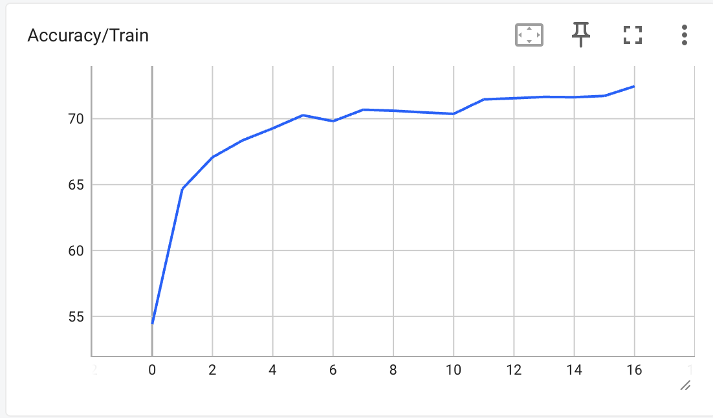 | 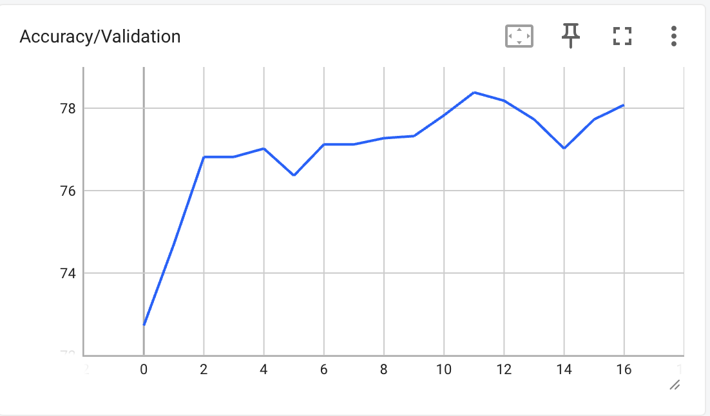  |
| 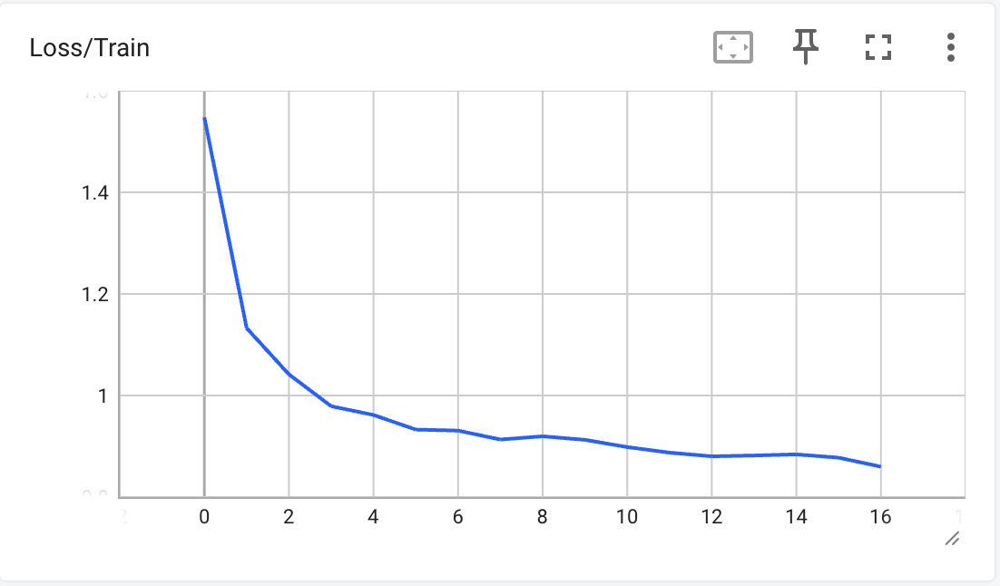 | 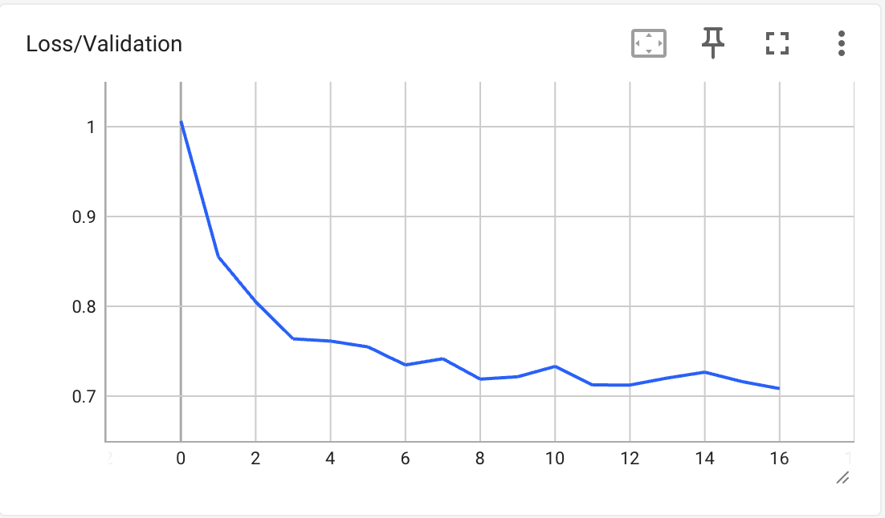  |
| 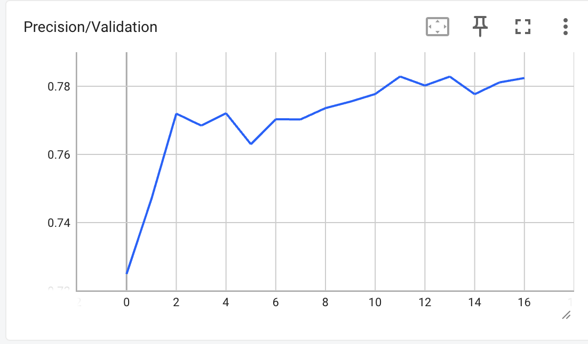   |     |
| 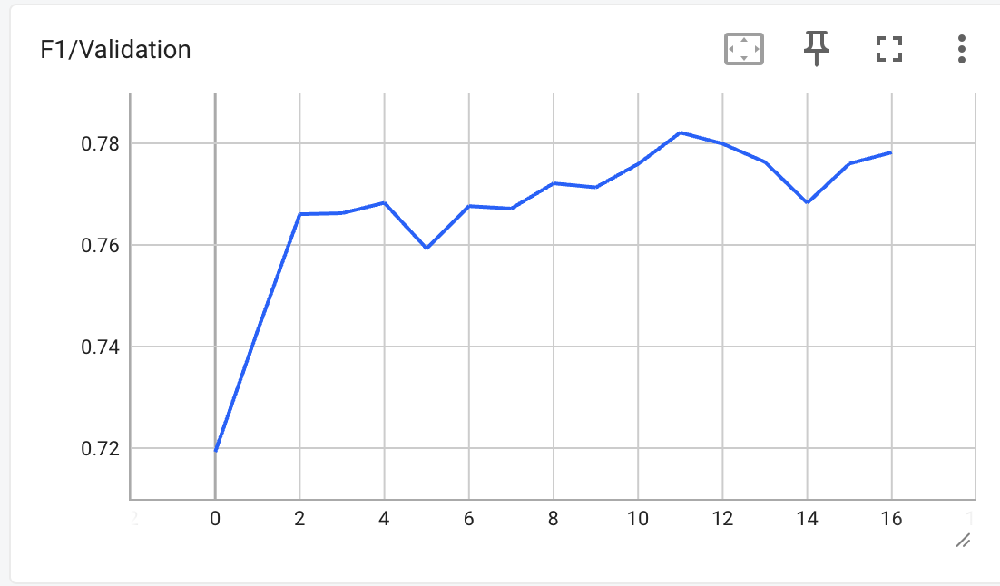   |                         |

---

## **EfficientNet-B0(fine-tuning + label smoothing + weighted sampling)**
> **upgrade_efficientnet_B0_finetune_food11.pth**

Улучшили базовую модель: разморозили последние слои, добавили label smoothing для снижения переобучения и weighted sampling для баланса классов.

Улучшения: Fine-tuning повысил точность на 3-4%, label smoothing сгладил уверенность предсказаний, weighted sampling компенсировал дисбаланс классов.

| Test Loss  | Val Accuracy  | Test Accuracy | Precision | Recall | F1    | Общее время |
|------------|---------------|---------------|-----------|--------|-------|-------------|
| 1.081      | 81.87%        | 79.00%        | 0.792     | 0.790  | 0.790 | 74.3 min    |


### Кусочек кода: Fine-tuning и разные LR
> **Fine-tuning — дообучение предобученной модели с разморозкой части слоёв.**
```python
model = models.efficientnet_b0(weights=models.EfficientNet_B0_Weights.IMAGENET1K_V1)
in_features = model.classifier[1].in_features
model.classifier[1] = nn.Linear(in_features, num_classes)

# Разморозка последних слоев
for name, param in model.named_parameters():
    if "features.6" in name or "features.7" in name or "classifier" in name:
        param.requires_grad = True
    else:
        param.requires_grad = False

optimizer = optim.Adam([
    {'params': model.features.parameters(), 'lr': 1e-5},
    {'params': model.classifier.parameters(), 'lr': 1e-3}
])
```

### Кусочек кода: Label Smoothing и Weighted Sampler
> **Label Smoothing — сглаживание меток: вместо [1, 0, 0] → [0.9, 0.05, 0.05].
Уменьшает переобучение, улучшает калибровку.**
> 
> > **Weighted Random Sampler — сэмплирование с весами, пропорциональными обратной частоте класса.
Компенсирует дисбаланс.**
```python
# Label Smoothing
criterion = nn.CrossEntropyLoss(label_smoothing=0.1, weight=torch.tensor(class_weights).to(device))

# Weighted Sampler для баланса
class_weights = [len(train_labels) / (num_classes * class_counts[i]) for i in range(num_classes)]
sample_weights = [class_weights[label] for label in train_labels]
sampler = WeightedRandomSampler(weights=sample_weights, num_samples=len(sample_weights), replacement=True)
```

### Матрица ошибок


### Ход обучения
| TensorBoard                     | TensorBoard                     |
|---------------------------------|---------------------------------|
|  | 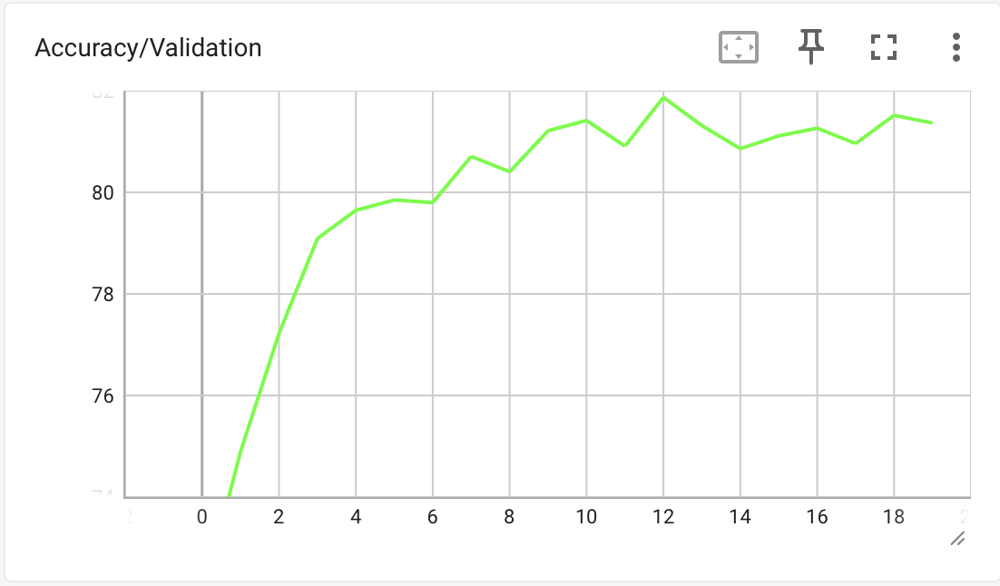 |
| 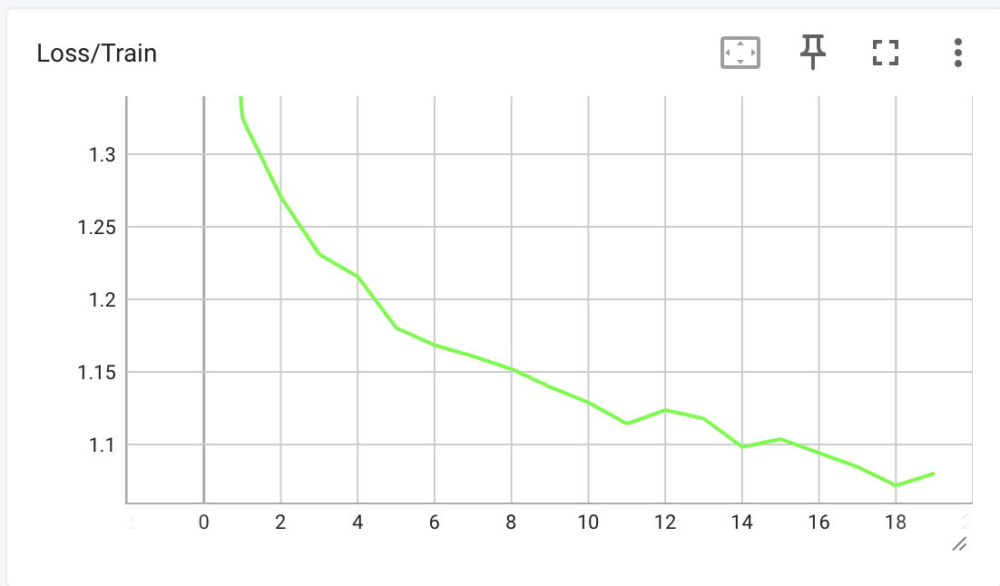 | 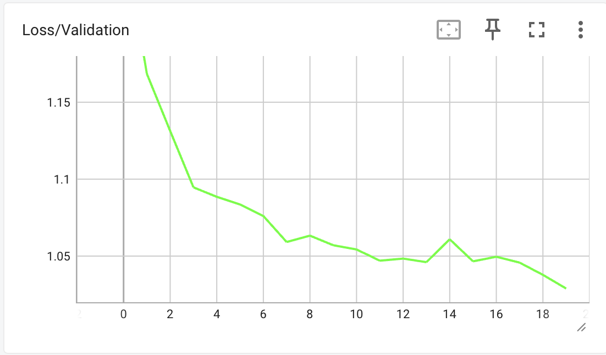 |
| 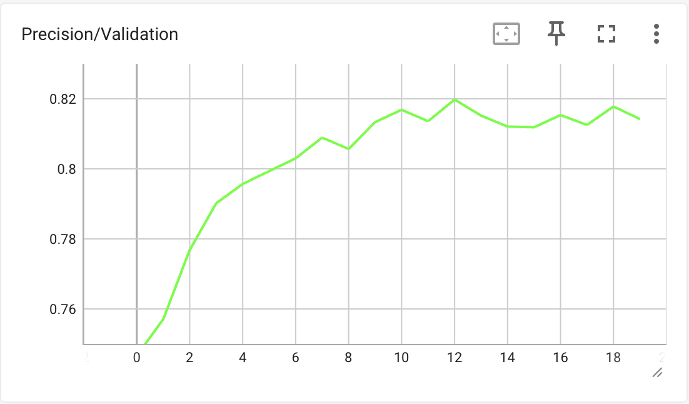   | 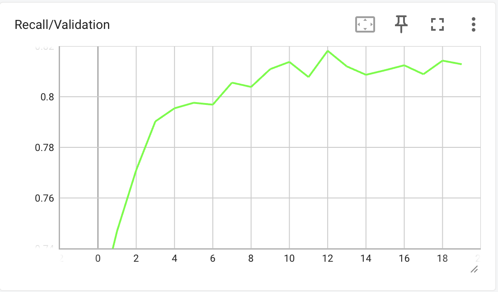   |
| 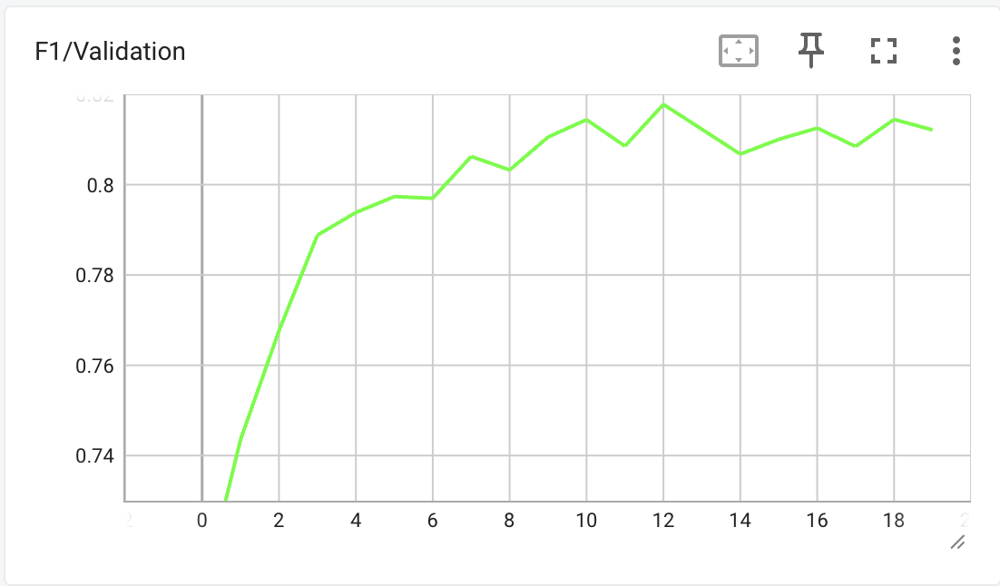   |                                 |

### TTA(5 аугментаций)
TTA Test Accuracy: 82.09%

> **TTA (Test Time Augmentation) — применение нескольких аугментаций к одному изображению на этапе инференса, усреднение предсказаний.**

```python
transforms_list = [
    transforms.RandomHorizontalFlip(p=1.0),
    transforms.RandomRotation(10),
    transforms.ColorJitter(brightness=0.1, contrast=0.1),
    transforms.RandomAffine(degrees=5, scale=(0.95, 1.05))
    ]
```

**Использованные аугментации (всего 5):**
1. **Оригинальное изображение**
2. **Горизонтальное отражение** (`RandomHorizontalFlip(p=1.0)`)
3. **Поворот на +10°** (`RandomRotation(10)`)
4. **Изменение яркости и контраста** (`ColorJitter(brightness=0.1, contrast=0.1)`)
5. **Аффинное преобразование с масштабированием** (`RandomAffine(degrees=5, scale=(0.95, 1.05))`)

### Матрица ошибок
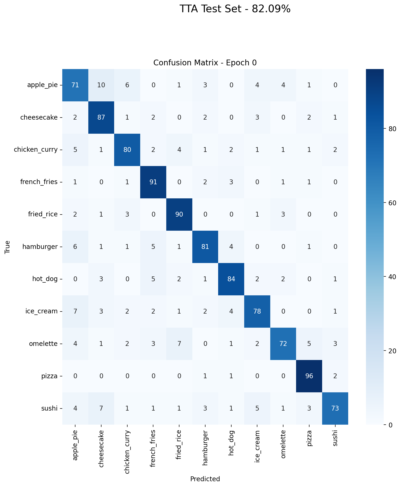


---

## **EfficientNet-B3(fine-tuning + label smoothing + weighted sampling)**
> **efficientnet_B3_food11.pth**

Перешли на более мощную B3. Увеличили аугментации, patience для early stopping и снизили LR для features.

Улучшения: Более глубокая модель + stronger аугментации подняли точность на ~3%.

| Test Loss  | Val Accuracy  | Test Accuracy | Precision | Recall | F1    | Общее время |
|------------|---------------|---------------|-----------|--------|-------|-------------|
| 1.001      | 84.34%        | 82.00%        | 0.821     | 0.820  | 0.820 | 119.9 min   |

### Увеличенные аугментации
```python
train_transform = transforms.Compose([
    transforms.Resize((300, 300)),  # Для B3
    transforms.RandomHorizontalFlip(),
    transforms.RandomRotation(20),  # Увеличено
    transforms.ColorJitter(brightness=0.3, contrast=0.3, saturation=0.3, hue=0.2),  # Сильнее
    transforms.RandomAffine(degrees=0, translate=(0.15, 0.15)),
    transforms.ToTensor(),
    transforms.Normalize([0.485, 0.456, 0.406], [0.229, 0.224, 0.225])
])
```

### Матрица ошибок


### Ход обучения
| TensorBoard              | TensorBoard              |
|--------------------------|--------------------------|
| 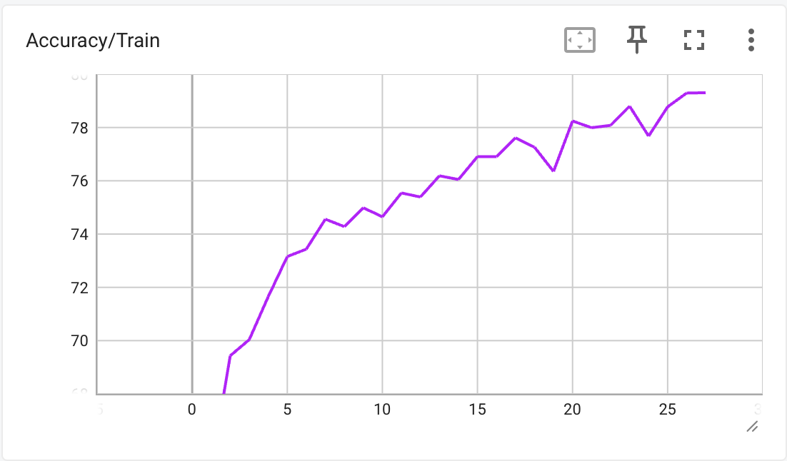   | 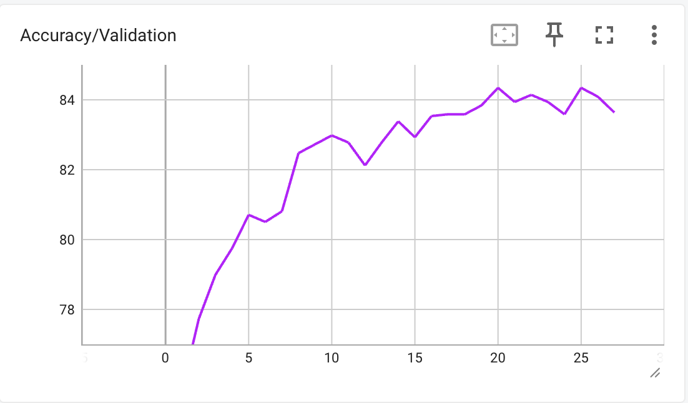   |
| 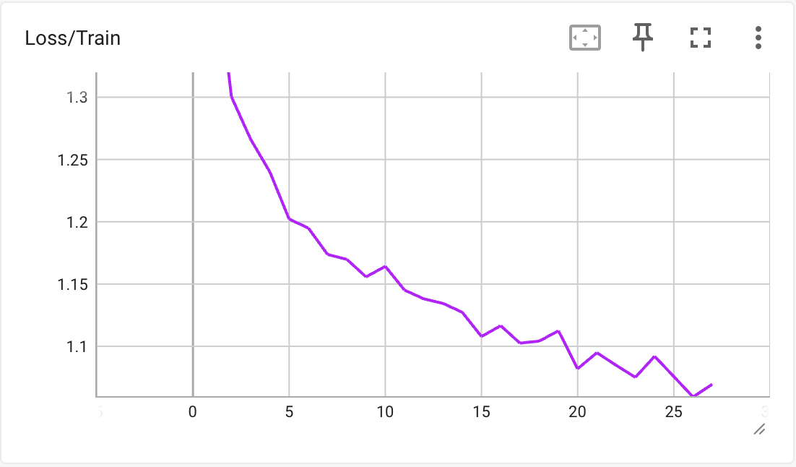   |    |
|      | 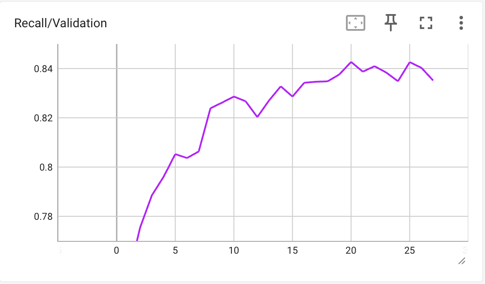     |
|      |                          |

### TTA(5 аугментаций)
TTA Test Accuracy: 84.82%

> **TTA (Test Time Augmentation) — применение нескольких аугментаций к одному изображению на этапе инференса, усреднение предсказаний.**

```python
transforms_list = [
    transforms.RandomHorizontalFlip(p=1.0),
    transforms.RandomRotation(10),
    transforms.ColorJitter(brightness=0.1, contrast=0.1),
    transforms.RandomAffine(degrees=5, scale=(0.95, 1.05))
    ]
```

**Использованные аугментации (всего 5):**
1. **Оригинальное изображение**
2. **Горизонтальное отражение** (`RandomHorizontalFlip(p=1.0)`)
3. **Поворот на +10°** (`RandomRotation(10)`)
4. **Изменение яркости и контраста** (`ColorJitter(brightness=0.1, contrast=0.1)`)
5. **Аффинное преобразование с масштабированием** (`RandomAffine(degrees=5, scale=(0.95, 1.05))`)

### Матрица ошибок
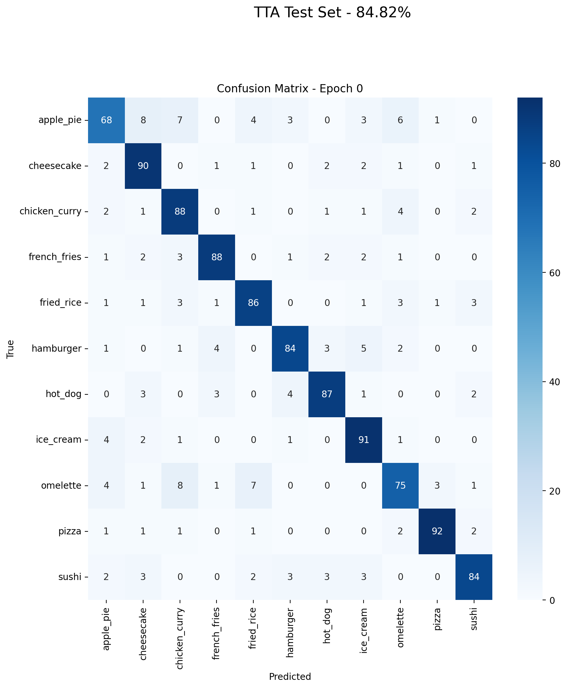

---

## **EfficientNet-B5(fine-tuning + label smoothing + weighted sampling)**
> **efficientnet_B5_food11.pth**

| Test Loss | Val Accuracy | Test Accuracy | Precision | Recall | F1 | Общее время |
|-----------|--------------|---------------|-----------|--------|----|-------------|
|           |              |               |           |        |    |             |

### Кусочек кода: Разморозка и Scheduler


### Матрица ошибо

### Ход обучения

### TTA(5 аугментаций)

### Матрица ошибок

---

## **ConvNeXt_V2(fine-tuning + label smoothing + weighted sampling)**
> **ConvNeXt_V2_food11.pth**

Переход на современную архитектуру **ConvNeXt Tiny** с **AdamW**, **CosineAnnealingWarmRestarts**, **clip_grad_norm**, разморозкой последних двух стадий и **weighted sampling**. Увеличено `patience`, добавлен **label smoothing 0.1** и **взвешенная выборка** для борьбы с дисбалансом.

| Test Loss  | Val Accuracy | Test Accuracy | Precision | Recall | F1    | Общее время |
|------------|--------------|---------------|-----------|--------|-------|-------------|
| 0.849      | 88.38%       | 88.55%        | 0.890     | 0.885  | 0.887 | 158.1 min   |


### Аугментации (train)
```python
train_transform = transforms.Compose([
    transforms.Resize((224, 224)),
    transforms.RandomHorizontalFlip(),
    transforms.RandomRotation(15),
    transforms.ColorJitter(brightness=0.2, contrast=0.2, saturation=0.2, hue=0.1),
    transforms.RandomAffine(degrees=0, translate=(0.1, 0.1)),
    transforms.ToTensor(),
    transforms.Normalize([0.485, 0.456, 0.406], [0.229, 0.224, 0.225])
])
```

### Матрица ошибок
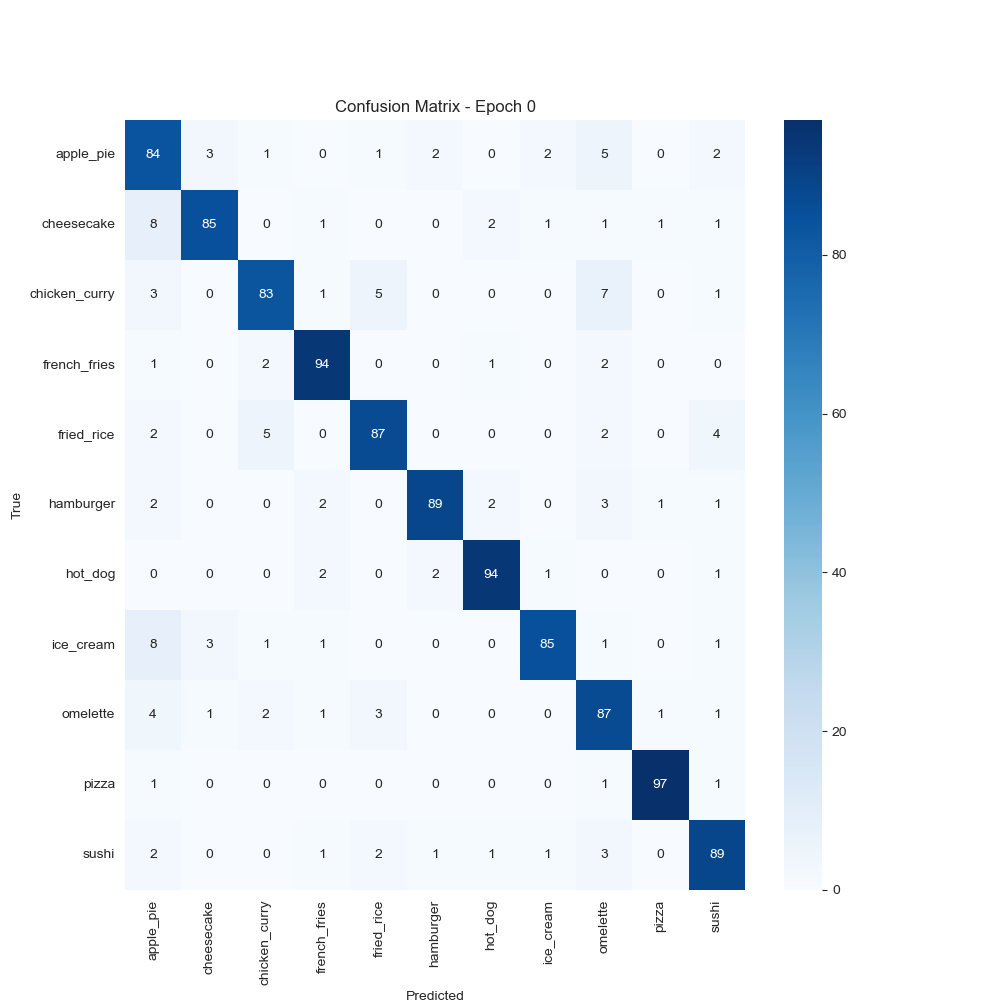

### Ход обучения
| TensorBoard                     | TensorBoard                     |
|---------------------------------|---------------------------------|
|  | 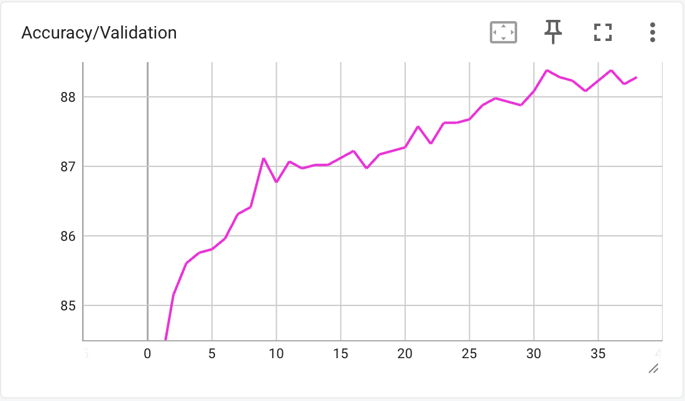 |
| 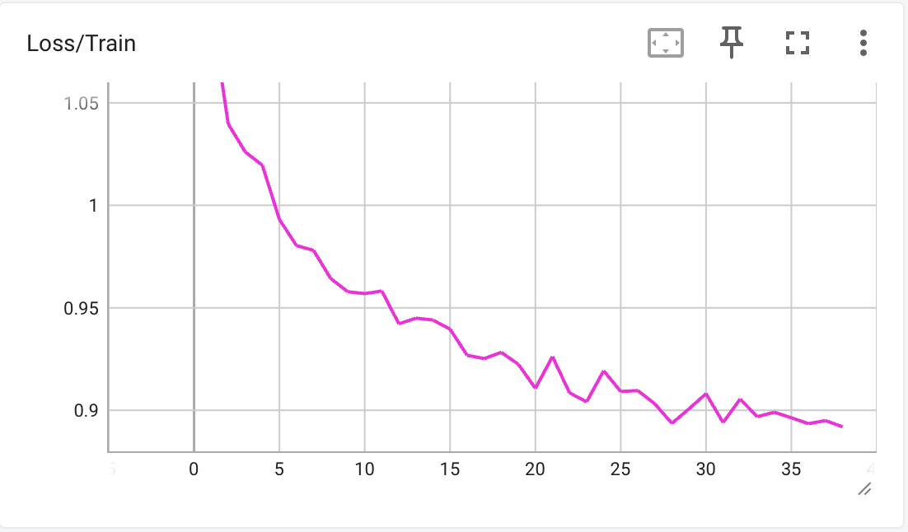 |  |
| 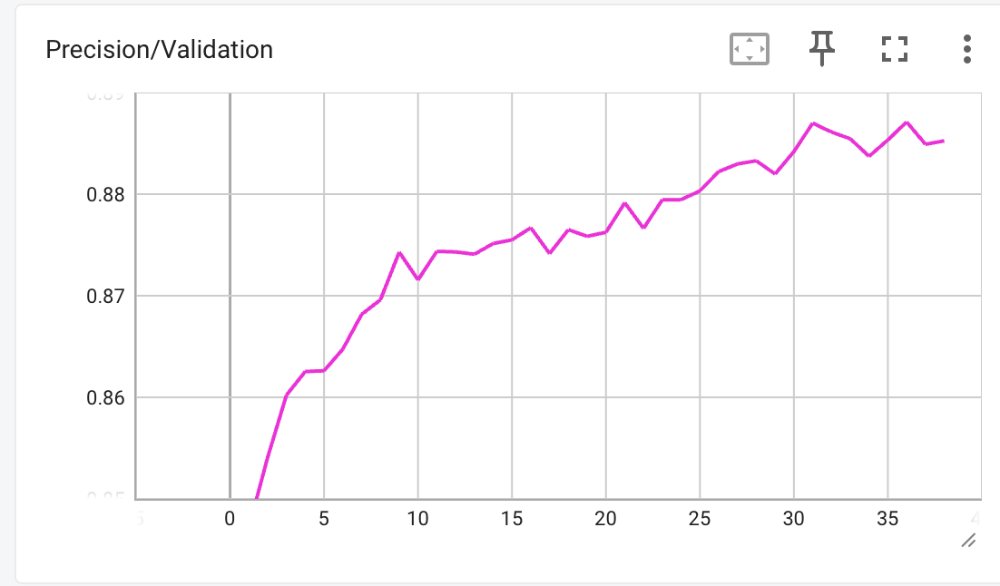   |    |
| 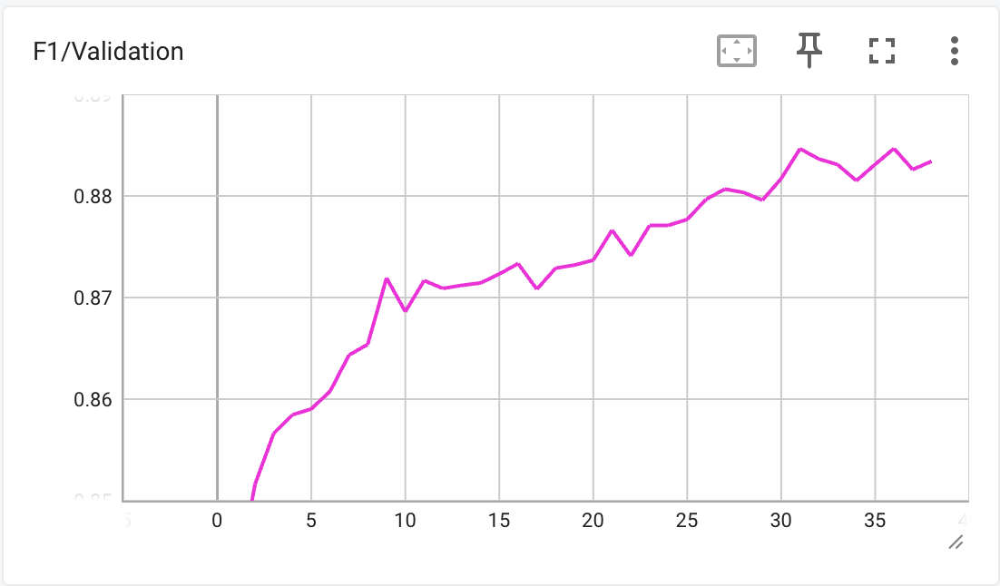   |                                 |

### TTA(5 аугментаций)
TTA Test Accuracy: 89.18%

> **TTA (Test Time Augmentation) — применение нескольких аугментаций к одному изображению на этапе инференса, усреднение предсказаний.**

### Матрица ошибок
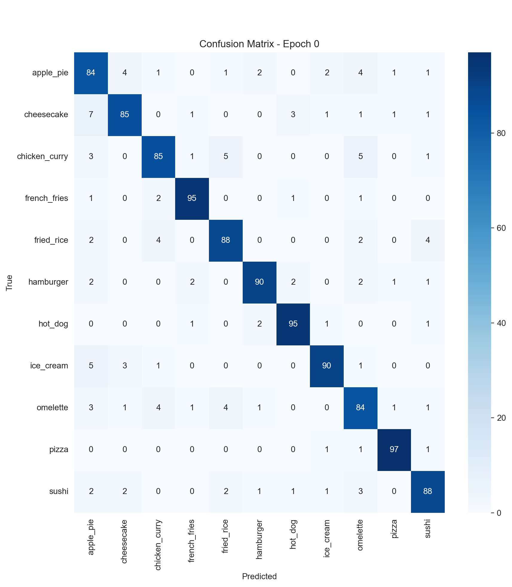

```python
transforms_list = [
    transforms.RandomHorizontalFlip(p=1.0),
    transforms.RandomRotation(10),
    transforms.ColorJitter(brightness=0.1, contrast=0.1),
    transforms.RandomAffine(degrees=5, scale=(0.95, 1.05))
    ]
```

**Использованные аугментации (всего 5):**
1. **Оригинальное изображение**
2. **Горизонтальное отражение** (`RandomHorizontalFlip(p=1.0)`)
3. **Поворот на +10°** (`RandomRotation(10)`)
4. **Изменение яркости и контраста** (`ColorJitter(brightness=0.1, contrast=0.1)`)
5. **Аффинное преобразование с масштабированием** (`RandomAffine(degrees=5, scale=(0.95, 1.05))`)

### Ключевые изменения

```python
# Архитектура
model = convnext_tiny(weights=ConvNeXt_Tiny_Weights.IMAGENET1K_V1)

# Разморозка последних стадий
for name, param in model.named_parameters():
    if "stages.2" in name or "stages.3" in name or "classifier" in name:
        param.requires_grad = True
    else:
        param.requires_grad = False

# Оптимизатор AdamW + раздельные LR
optimizer = optim.AdamW([
    {'params': [p for n, p in model.named_parameters() if "stages.2" in n or "stages.3" in n], 'lr': 3e-6},
    {'params': model.classifier.parameters(), 'lr': 3e-4}
], weight_decay=1e-4)

# CosineAnnealingWarmRestarts
scheduler = optim.lr_scheduler.CosineAnnealingWarmRestarts(optimizer, T_0=15, T_mult=2)

# Градиентный клиппинг
torch.nn.utils.clip_grad_norm_(model.parameters(), max_norm=1.0)

# Weighted loss + label smoothing
criterion = nn.CrossEntropyLoss(label_smoothing=0.1, weight=class_weights_tensor)
```
---

## **DaViT_Tiny(fine-tuning + label smoothing + weighted sampling)**
> **DaViT_Tiny_food11.pth**

В ПРОЦЕССЕ

| Test Loss | Val Accuracy | Test Accuracy | Precision | Recall | F1    | Общее время |
|-----------|--------------|---------------|-----------|--------|-------|-------------|
|           | 88.38%       | 88.55%        | 0.890     | 0.885  | 0.887 | 158.1 min   |


### Аугментации (train)
```python
```

### Матрица ошибок


### Ход обучения
| TensorBoard                     | TensorBoard                     |
|---------------------------------|---------------------------------|
|  |  |
|  |  |
|    |    |
|    |                                 |

### TTA(5 аугментаций)
TTA Test Accuracy: 

> **TTA (Test Time Augmentation) — применение нескольких аугментаций к одному изображению на этапе инференса, усреднение предсказаний.**

### Матрица ошибок


```python
transforms_list = [
    transforms.RandomHorizontalFlip(p=1.0),
    transforms.RandomRotation(10),
    transforms.ColorJitter(brightness=0.1, contrast=0.1),
    transforms.RandomAffine(degrees=5, scale=(0.95, 1.05))
    ]
```

**Использованные аугментации (всего 5):**
1. **Оригинальное изображение**
2. **Горизонтальное отражение** (`RandomHorizontalFlip(p=1.0)`)
3. **Поворот на +10°** (`RandomRotation(10)`)
4. **Изменение яркости и контраста** (`ColorJitter(brightness=0.1, contrast=0.1)`)
5. **Аффинное преобразование с масштабированием** (`RandomAffine(degrees=5, scale=(0.95, 1.05))`)

### Ключевые изменения


---