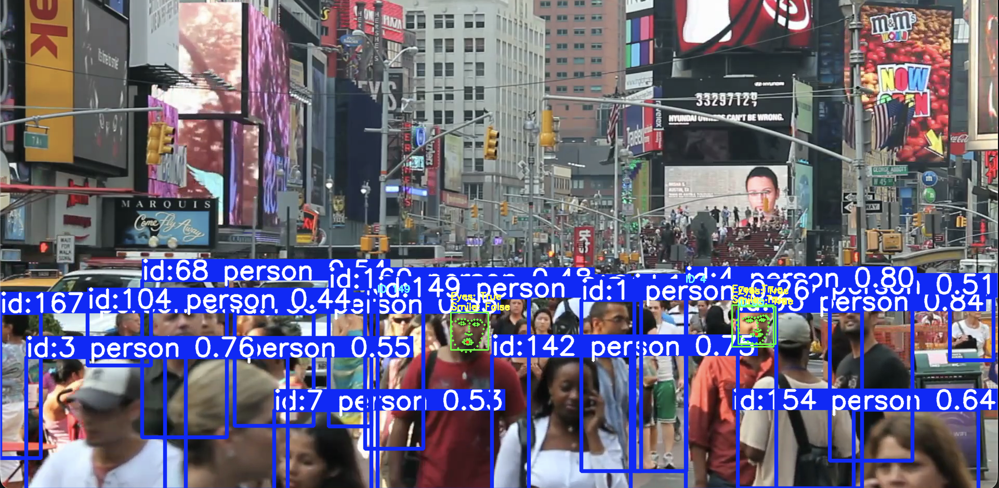
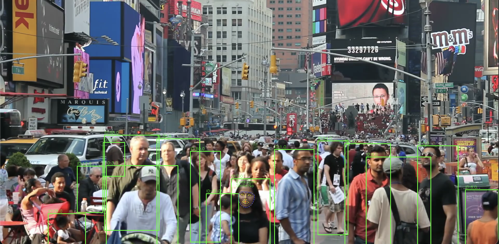
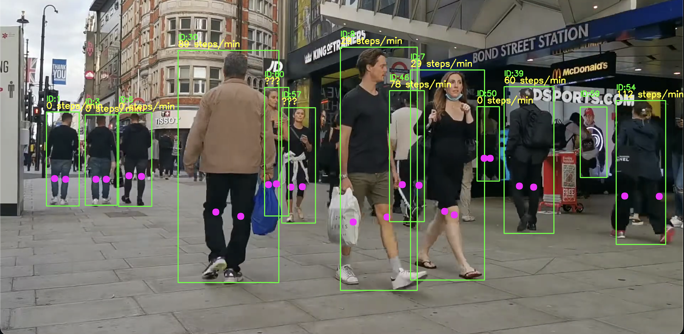

# Система анализа людей на видео  
**YOLOv8 + MediaPipe + dlib + Pose Estimation**

Проект реализует многофункциональную систему компьютерного зрения для детекции, трекинга и анализа людей в видеопотоке. Поддерживаются следующие возможности:

- Детекция и трекинг людей (YOLOv8 + ByteTrack)
- Обнаружение лиц и 68 ключевых точек лица (dlib)
- Анализ мимики: определение улыбки и закрытых глаз
- Оценка позы человека (YOLOv8-pose)
- Подсчёт частоты шагов в реальном времени

---

### Возможности проекта

| Функция                     | Используемая модель/библиотека       | Описание |
|--------------------------------|---------------------------------------|--------|
| Детекция и трекинг людей       | YOLOv8n + ByteTrack                   | Стабильный трекинг с присвоением ID |
| Обнаружение лиц                | MediaPipe Face Detection / dlib       | Два подхода для разных задач |
| 68 ключевых точек лица         | dlib shape_predictor_68_face_landmarks| Точное определение контуров лица |
| Определение улыбки             | Геометрический анализ рта             | На основе соотношения ширины/высоты и подъёма уголков |
| Определение закрытых глаз      | Eye Aspect Ratio (EAR)                | Классический алгоритм обнаружения сонливости |
| Оценка позы (17/18 точек)      | YOLOv8-pose / YOLOv11-pose            | Ключевые точки тела |
| Подсчёт шагов                  | Анализ вертикальных колебаний ног     | По ключевым точкам коленей |

---

###Структура ноутбука (main.ipynb)

Ячейка 1 – Простая детекция людей + лица через MediaPipe
Ячейка 2 – Полный анализ лица (68 точек) + улыбка + глаза + трекинг по ROI

Ячейка 3 – Глобальный детектор лиц dlib + convex hull + анализ мимики

Ячейка 4 – Pose estimation + подсчёт шагов в реальном времени (ByteTrack + анализ колебаний коленей)

